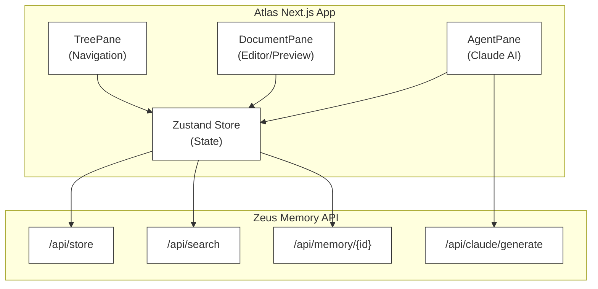

# Project: Atlas Workspace

**Project ID**: 2026-01-28-atlas-workspace
**Date**: 2026-01-28
**Status**: ACTIVE
**Owner**: JK (ALDC)
**Development Mode**: AI-First Development (Claude Code as primary implementation engine)

---

## AI-First Development Model

This project follows Claude Code as the primary implementation engine. Human role is strategic direction, requirements definition, approval, and oversight.

---

## Executive Summary

Atlas is a **3-pane markdown-first workspace** with Claude AI integration. It provides a document management interface with tree navigation (left), markdown editor/preview (center), and AI assistant (right).

**Key Goals:**
- Provide an intuitive markdown workspace for document management
- Integrate Claude AI for document generation and revision suggestions
- Store documents persistently in Zeus Memory
- Deploy as standalone app at `atlas.aldc.io`

**Expected Impact:**
- Centralized document management with AI assistance
- Faster content creation through Claude-powered generation
- Searchable, hierarchical document organization

---

## Scope

### In Scope
- 3-pane layout (Tree, Document, Agent)
- Markdown editing with live preview
- Document tree with parent/child hierarchy
- Zeus Memory integration for persistence
- Claude agent for document actions (create, revise, generate subtopics)
- Keyboard shortcuts (Cmd+K, Cmd+Shift+E, Cmd+\)
- Search functionality

### Out of Scope
- Multi-user collaboration (real-time editing)
- Version control beyond basic revision history
- File upload/attachment support
- Mobile-specific layouts

### Dependencies
- Zeus Memory API (https://zeus.aldc.io)
- Claude API (via Zeus integration)
- Azure Container Apps (deployment)
- Cloudflare DNS (atlas.aldc.io)

---

## Technical Architecture

### Architecture Diagram

### Technology Stack
- **Frontend**: Next.js 16, React 19, Mantine 7, TailwindCSS 4
- **State**: Zustand
- **Markdown**: react-markdown, remark-gfm
- **Backend**: Zeus Memory API
- **Infrastructure**: Azure Container Apps, Cloudflare DNS

### Key Decisions
1. **Standalone App**: Deployed separately at `atlas.aldc.io` (not embedded in Eclipse)
2. **Polyrepo Pattern**: Following ALDC repository strategy with dedicated `ALDC-io/atlas` repo
3. **Zeus Memory Storage**: Documents stored as memories with type metadata for efficient retrieval

---

## Implementation Plan

### Phase 1: Core App Setup (COMPLETED)
**Estimated Sessions**: 1-2 sessions
**Status**: COMPLETE

- [x] Initialize Next.js 16 project with Mantine, TailwindCSS
- [x] Create TypeScript types (AtlasNode, AtlasRevision, AgentAction)
- [x] Create Zustand store for state management
- [x] Create Zeus Memory API integration library

### Phase 2: UI Components (COMPLETED)
**Estimated Sessions**: 2-3 sessions
**Status**: COMPLETE

- [x] TreePane component with recursive tree rendering
- [x] DocumentPane component with markdown editor and preview
- [x] AgentPane component with action buttons and chat
- [x] AtlasWorkspace container component
- [x] Main page.tsx to render workspace

### Phase 3: Infrastructure & Deployment (IN PROGRESS)
**Estimated Sessions**: 1-2 sessions
**Status**: IN PROGRESS

- [ ] Create GitHub repo `ALDC-io/atlas`
- [ ] Create `atlas.aldc.io` DNS record in Cloudflare
- [ ] Create Dockerfile for containerization
- [ ] Deploy to Azure Container Apps
- [ ] Configure custom domain

---

## Success Criteria

### Performance Targets
- First Contentful Paint: < 1.5s
- Lighthouse Score: > 90
- Document load time: < 500ms

### Quality Targets
- All components render without errors
- Keyboard shortcuts work reliably
- Zeus Memory sync succeeds

### Business Targets
- Usable workspace for document management
- AI actions generate relevant content

---

## Testing Strategy

### Unit Tests
- [ ] Zustand store actions
- [ ] Zeus API integration functions

### Integration Tests
- [ ] Document CRUD operations
- [ ] Search functionality

### End-to-End Tests
- [ ] Create/edit/delete document flow
- [ ] Agent action execution

---

## Security & Data Practices

### Security Checklist
- [x] API key stored as environment variable (NEXT_PUBLIC_ZEUS_API_KEY)
- [x] No secrets committed to repository
- [ ] Input validation for document content
- [ ] XSS protection via react-markdown

---

## Deliverables

1. **Atlas Web App** - 3-pane workspace at `atlas.aldc.io`
2. **GitHub Repository** - `ALDC-io/atlas` with CI/CD
3. **Documentation** - This PROJECT_PLAN.md and README.md

---

## References

### Codebase Locations
- Primary repo: `/home/aldc/repos/atlas`
- GitHub: `github.com/ALDC-io/atlas` (to be created)

### Related Projects
- **Zeus Memory**: Backend storage and AI integration
- **Eclipse**: ALDC app platform (Atlas is standalone, not embedded)

---

## Revision History

| Date | Version | Changes | Author |
|------|---------|---------|--------|
| 2026-01-28 | 1.0.0 | Initial project creation | Claude Code |

---

**Last Updated**: 2026-01-28
**Template Version**: 2.2.0
**Status**: ACTIVE
